# 数据库设计文档

## 1. 数据库实体关系图 (ERD)

```mermaid
erDiagram
    tenants ||--o{ users : "拥有"
    users ||--o{ user_profiles : "拥有"
    users ||--o{ user_metrics_history : "记录"
    users ||--o{ workouts : "创建"
    users ||--o{ nutrition_logs : "记录"
    users ||--o{ workout_plans : "制定"
    users ||--o{ feed_posts : "发布"
    users ||--o{ feed_comments : "评论"
    users ||--o{ achievements : "获得"
    users ||--o{ device_syncs : "同步"
    users ||--o{ notifications : "接收"
    
    workout_types ||--o{ workouts : "分类"
    workout_types ||--o{ workout_plans : "分类"
    foods ||--o{ nutrition_logs : "包含"
    meals ||--o{ nutrition_logs : "属于"
    
    tenants {
        int id PK
        string name
        string subdomain
        datetime created_at
        datetime updated_at
    }
    
    users {
        int id PK
        int tenant_id FK
        string email
        string password_hash
        string name
        string role
        string oauth_provider
        string oauth_id
        datetime last_login
        datetime created_at
        datetime updated_at
    }
    
    user_profiles {
        int id PK
        int user_id FK
        int height
        int weight
        int age
        string gender
        string avatar_url
        string bio
        datetime created_at
        datetime updated_at
    }
    
    user_metrics_history {
        int id PK
        int user_id FK
        decimal weight
        decimal bmi
        decimal body_fat_percentage
        decimal bmr
        date recorded_date
        datetime created_at
        datetime updated_at
    }
    
    workout_types {
        int id PK
        string name
        string description
        string icon_url
        decimal met_value
        datetime created_at
        datetime updated_at
    }
    
    workouts {
        int id PK
        int user_id FK
        int workout_type_id FK
        string name
        int duration_minutes
        int calories_burned
        decimal distance_km
        int steps
        json extra_data
        datetime start_time
        datetime end_time
        datetime created_at
        datetime updated_at
    }
    
    workout_plans {
        int id PK
        int user_id FK
        int workout_type_id FK
        string name
        string description
        string goal
        int duration_weeks
        json plan_details
        datetime start_date
        datetime end_date
        boolean is_active
        datetime created_at
        datetime updated_at
    }
    
    meals {
        int id PK
        string name
        string description
        datetime created_at
        datetime updated_at
    }
    
    foods {
        int id PK
        string name
        string brand
        decimal calories
        decimal protein_g
        decimal carbs_g
        decimal fat_g
        decimal serving_size
        string serving_unit
        json nutrients
        datetime created_at
        datetime updated_at
    }
    
    nutrition_logs {
        int id PK
        int user_id FK
        int meal_id FK
        int food_id FK
        decimal quantity
        datetime consumed_at
        datetime created_at
        datetime updated_at
    }
    
    feed_posts {
        int id PK
        int user_id FK
        string content
        string media_urls
        int likes_count
        int comments_count
        boolean is_public
        datetime created_at
        datetime updated_at
    }
    
    feed_comments {
        int id PK
        int user_id FK
        int post_id FK
        string content
        int likes_count
        datetime created_at
        datetime updated_at
    }
    
    achievements {
        int id PK
        int user_id FK
        string name
        string description
        string icon_url
        datetime achieved_at
        datetime created_at
    }
    
    device_syncs {
        int id PK
        int user_id FK
        string device_type
        string device_id
        json sync_data
        datetime last_synced_at
        datetime created_at
        datetime updated_at
    }
    
    notifications {
        int id PK
        int user_id FK
        string type
        string title
        string content
        json payload
        boolean is_read
        datetime sent_at
        datetime created_at
    }
```



## 2. 数据库表详细设计

### 2.1 租户表 (tenants)
存储系统租户信息，支持多租户架构。

```sql
CREATE TABLE tenants (
    id INT AUTO_INCREMENT PRIMARY KEY,
    name VARCHAR(255) NOT NULL COMMENT '租户名称',
    subdomain VARCHAR(100) UNIQUE NOT NULL COMMENT '子域名',
    created_at TIMESTAMP DEFAULT CURRENT_TIMESTAMP,
    updated_at TIMESTAMP DEFAULT CURRENT_TIMESTAMP ON UPDATE CURRENT_TIMESTAMP,
    
    INDEX idx_subdomain (subdomain)
) COMMENT='租户信息表';
```

### 2.2 用户表 (users)
存储系统用户基本信息。

```sql
CREATE TABLE users (
    id INT AUTO_INCREMENT PRIMARY KEY,
    tenant_id INT NOT NULL COMMENT '租户ID',
    email VARCHAR(255) UNIQUE NOT NULL COMMENT '邮箱',
    password_hash VARCHAR(255) COMMENT '密码哈希',
    name VARCHAR(100) NOT NULL COMMENT '姓名',
    role ENUM('user', 'coach', 'admin') DEFAULT 'user' COMMENT '用户角色',
    oauth_provider VARCHAR(50) COMMENT 'OAuth提供商',
    oauth_id VARCHAR(255) COMMENT 'OAuth用户ID',
    last_login TIMESTAMP NULL COMMENT '最后登录时间',
    created_at TIMESTAMP DEFAULT CURRENT_TIMESTAMP,
    updated_at TIMESTAMP DEFAULT CURRENT_TIMESTAMP ON UPDATE CURRENT_TIMESTAMP,
    
    FOREIGN KEY (tenant_id) REFERENCES tenants(id) ON DELETE CASCADE,
    INDEX idx_tenant_email (tenant_id, email),
    INDEX idx_oauth (oauth_provider, oauth_id)
) COMMENT='用户表';
```

### 2.3 用户档案表 (user_profiles)
存储用户的个人档案信息。

```sql
CREATE TABLE user_profiles (
    id INT AUTO_INCREMENT PRIMARY KEY,
    user_id INT UNIQUE NOT NULL COMMENT '用户ID',
    height INT COMMENT '身高(cm)',
    weight INT COMMENT '体重(g)',
    age INT COMMENT '年龄',
    gender ENUM('male', 'female', 'other') COMMENT '性别',
    avatar_url VARCHAR(500) COMMENT '头像URL',
    bio TEXT COMMENT '个人简介',
    created_at TIMESTAMP DEFAULT CURRENT_TIMESTAMP,
    updated_at TIMESTAMP DEFAULT CURRENT_TIMESTAMP ON UPDATE CURRENT_TIMESTAMP,
    
    FOREIGN KEY (user_id) REFERENCES users(id) ON DELETE CASCADE,
    INDEX idx_user_id (user_id)
) COMMENT='用户档案表';
```

### 2.4 用户健康指标历史表 (user_metrics_history)
存储用户健康指标的历史数据。

```sql
CREATE TABLE user_metrics_history (
    id INT AUTO_INCREMENT PRIMARY KEY,
    user_id INT NOT NULL COMMENT '用户ID',
    weight DECIMAL(5,2) COMMENT '体重(kg)',
    bmi DECIMAL(4,2) COMMENT 'BMI',
    body_fat_percentage DECIMAL(4,2) COMMENT '体脂率',
    bmr INT COMMENT '基础代谢率',
    recorded_date DATE NOT NULL COMMENT '记录日期',
    created_at TIMESTAMP DEFAULT CURRENT_TIMESTAMP,
    updated_at TIMESTAMP DEFAULT CURRENT_TIMESTAMP ON UPDATE CURRENT_TIMESTAMP,
    
    FOREIGN KEY (user_id) REFERENCES users(id) ON DELETE CASCADE,
    INDEX idx_user_date (user_id, recorded_date),
    INDEX idx_recorded_date (recorded_date)
) COMMENT='用户健康指标历史表';
```

### 2.5 运动类型表 (workout_types)
存储系统支持的运动类型。

```sql
CREATE TABLE workout_types (
    id INT AUTO_INCREMENT PRIMARY KEY,
    name VARCHAR(100) NOT NULL COMMENT '运动类型名称',
    description TEXT COMMENT '描述',
    icon_url VARCHAR(500) COMMENT '图标URL',
    met_value DECIMAL(3,2) NOT NULL DEFAULT 1.0 COMMENT '代谢当量(MET)',
    created_at TIMESTAMP DEFAULT CURRENT_TIMESTAMP,
    updated_at TIMESTAMP DEFAULT CURRENT_TIMESTAMP ON UPDATE CURRENT_TIMESTAMP,
    
    UNIQUE KEY uk_name (name)
) COMMENT='运动类型表';
```

### 2.6 运动记录表 (workouts)
存储用户的运动记录数据。

```sql
CREATE TABLE workouts (
    id INT AUTO_INCREMENT PRIMARY KEY,
    user_id INT NOT NULL COMMENT '用户ID',
    workout_type_id INT NOT NULL COMMENT '运动类型ID',
    name VARCHAR(255) NOT NULL COMMENT '运动名称',
    duration_minutes INT NOT NULL DEFAULT 0 COMMENT '运动时长(分钟)',
    calories_burned INT NOT NULL DEFAULT 0 COMMENT '消耗卡路里',
    distance_km DECIMAL(6,3) COMMENT '距离(km)',
    steps INT COMMENT '步数',
    extra_data JSON COMMENT '额外数据(JSON格式)',
    start_time TIMESTAMP NOT NULL COMMENT '开始时间',
    end_time TIMESTAMP NOT NULL COMMENT '结束时间',
    created_at TIMESTAMP DEFAULT CURRENT_TIMESTAMP,
    updated_at TIMESTAMP DEFAULT CURRENT_TIMESTAMP ON UPDATE CURRENT_TIMESTAMP,
    
    FOREIGN KEY (user_id) REFERENCES users(id) ON DELETE CASCADE,
    FOREIGN KEY (workout_type_id) REFERENCES workout_types(id),
    INDEX idx_user_start_time (user_id, start_time),
    INDEX idx_workout_type (workout_type_id)
) COMMENT='运动记录表';
```

### 2.7 运动计划表 (workout_plans)
存储用户的运动计划。

```sql
CREATE TABLE workout_plans (
    id INT AUTO_INCREMENT PRIMARY KEY,
    user_id INT NOT NULL COMMENT '用户ID',
    workout_type_id INT COMMENT '运动类型ID',
    name VARCHAR(255) NOT NULL COMMENT '计划名称',
    description TEXT COMMENT '计划描述',
    goal TEXT COMMENT '训练目标',
    duration_weeks INT NOT NULL DEFAULT 4 COMMENT '计划周期(周)',
    plan_details JSON COMMENT '计划详情(JSON格式)',
    start_date DATE COMMENT '开始日期',
    end_date DATE COMMENT '结束日期',
    is_active BOOLEAN DEFAULT TRUE COMMENT '是否激活',
    created_at TIMESTAMP DEFAULT CURRENT_TIMESTAMP,
    updated_at TIMESTAMP DEFAULT CURRENT_TIMESTAMP ON UPDATE CURRENT_TIMESTAMP,
    
    FOREIGN KEY (user_id) REFERENCES users(id) ON DELETE CASCADE,
    FOREIGN KEY (workout_type_id) REFERENCES workout_types(id),
    INDEX idx_user_active (user_id, is_active),
    INDEX idx_workout_type (workout_type_id)
) COMMENT='运动计划表';
```

### 2.8 餐次表 (meals)
存储餐次信息（早餐、午餐、晚餐等）。

```sql
CREATE TABLE meals (
    id INT AUTO_INCREMENT PRIMARY KEY,
    name VARCHAR(100) NOT NULL COMMENT '餐次名称',
    description TEXT COMMENT '描述',
    created_at TIMESTAMP DEFAULT CURRENT_TIMESTAMP,
    updated_at TIMESTAMP DEFAULT CURRENT_TIMESTAMP ON UPDATE CURRENT_TIMESTAMP,
    
    UNIQUE KEY uk_name (name)
) COMMENT='餐次表';
```

### 2.9 食物表 (foods)
存储食物营养成分数据。

```sql
CREATE TABLE foods (
    id INT AUTO_INCREMENT PRIMARY KEY,
    name VARCHAR(255) NOT NULL COMMENT '食物名称',
    brand VARCHAR(255) COMMENT '品牌',
    calories DECIMAL(6,2) NOT NULL DEFAULT 0 COMMENT '热量(千卡)',
    protein_g DECIMAL(5,2) NOT NULL DEFAULT 0 COMMENT '蛋白质(g)',
    carbs_g DECIMAL(5,2) NOT NULL DEFAULT 0 COMMENT '碳水化合物(g)',
    fat_g DECIMAL(5,2) NOT NULL DEFAULT 0 COMMENT '脂肪(g)',
    serving_size DECIMAL(6,2) NOT NULL DEFAULT 100 COMMENT '份量',
    serving_unit VARCHAR(50) NOT NULL DEFAULT 'g' COMMENT '份量单位',
    nutrients JSON COMMENT '详细营养成分(JSON格式)',
    created_at TIMESTAMP DEFAULT CURRENT_TIMESTAMP,
    updated_at TIMESTAMP DEFAULT CURRENT_TIMESTAMP ON UPDATE CURRENT_TIMESTAMP,
    
    INDEX idx_name (name),
    INDEX idx_brand (brand)
) COMMENT='食物表';
```

### 2.10 营养记录表 (nutrition_logs)
存储用户的营养摄入记录。

```sql
CREATE TABLE nutrition_logs (
    id INT AUTO_INCREMENT PRIMARY KEY,
    user_id INT NOT NULL COMMENT '用户ID',
    meal_id INT NOT NULL COMMENT '餐次ID',
    food_id INT NOT NULL COMMENT '食物ID',
    quantity DECIMAL(6,2) NOT NULL DEFAULT 1 COMMENT '份数',
    consumed_at TIMESTAMP NOT NULL DEFAULT CURRENT_TIMESTAMP COMMENT '摄入时间',
    created_at TIMESTAMP DEFAULT CURRENT_TIMESTAMP,
    updated_at TIMESTAMP DEFAULT CURRENT_TIMESTAMP ON UPDATE CURRENT_TIMESTAMP,
    
    FOREIGN KEY (user_id) REFERENCES users(id) ON DELETE CASCADE,
    FOREIGN KEY (meal_id) REFERENCES meals(id),
    FOREIGN KEY (food_id) REFERENCES foods(id),
    INDEX idx_user_consumed (user_id, consumed_at),
    INDEX idx_meal (meal_id),
    INDEX idx_food (food_id)
) COMMENT='营养记录表';
```

### 2.11 动态帖子表 (feed_posts)
存储用户发布的动态。

```sql
CREATE TABLE feed_posts (
    id INT AUTO_INCREMENT PRIMARY KEY,
    user_id INT NOT NULL COMMENT '用户ID',
    content TEXT NOT NULL COMMENT '内容',
    media_urls JSON COMMENT '媒体URL列表',
    likes_count INT DEFAULT 0 COMMENT '点赞数',
    comments_count INT DEFAULT 0 COMMENT '评论数',
    is_public BOOLEAN DEFAULT TRUE COMMENT '是否公开',
    created_at TIMESTAMP DEFAULT CURRENT_TIMESTAMP,
    updated_at TIMESTAMP DEFAULT CURRENT_TIMESTAMP ON UPDATE CURRENT_TIMESTAMP,
    
    FOREIGN KEY (user_id) REFERENCES users(id) ON DELETE CASCADE,
    INDEX idx_user_created (user_id, created_at),
    INDEX idx_created_public (created_at, is_public)
) COMMENT='动态帖子表';
```

### 2.12 动态评论表 (feed_comments)
存储动态的评论。

```sql
CREATE TABLE feed_comments (
    id INT AUTO_INCREMENT PRIMARY KEY,
    user_id INT NOT NULL COMMENT '用户ID',
    post_id INT NOT NULL COMMENT '帖子ID',
    content TEXT NOT NULL COMMENT '评论内容',
    likes_count INT DEFAULT 0 COMMENT '点赞数',
    created_at TIMESTAMP DEFAULT CURRENT_TIMESTAMP,
    updated_at TIMESTAMP DEFAULT CURRENT_TIMESTAMP ON UPDATE CURRENT_TIMESTAMP,
    
    FOREIGN KEY (user_id) REFERENCES users(id) ON DELETE CASCADE,
    FOREIGN KEY (post_id) REFERENCES feed_posts(id) ON DELETE CASCADE,
    INDEX idx_post_created (post_id, created_at),
    INDEX idx_user (user_id)
) COMMENT='动态评论表';
```

### 2.13 成就表 (achievements)
存储用户获得的成就。

```sql
CREATE TABLE achievements (
    id INT AUTO_INCREMENT PRIMARY KEY,
    user_id INT NOT NULL COMMENT '用户ID',
    name VARCHAR(100) NOT NULL COMMENT '成就名称',
    description TEXT COMMENT '成就描述',
    icon_url VARCHAR(500) COMMENT '图标URL',
    achieved_at TIMESTAMP NOT NULL DEFAULT CURRENT_TIMESTAMP COMMENT '达成时间',
    created_at TIMESTAMP DEFAULT CURRENT_TIMESTAMP,
    
    FOREIGN KEY (user_id) REFERENCES users(id) ON DELETE CASCADE,
    UNIQUE KEY uk_user_achievement (user_id, name),
    INDEX idx_user_achieved (user_id, achieved_at)
) COMMENT='成就表';
```

### 2.14 设备同步表 (device_syncs)
存储用户设备同步信息。

```sql
CREATE TABLE device_syncs (
    id INT AUTO_INCREMENT PRIMARY KEY,
    user_id INT NOT NULL COMMENT '用户ID',
    device_type VARCHAR(50) NOT NULL COMMENT '设备类型',
    device_id VARCHAR(255) NOT NULL COMMENT '设备ID',
    sync_data JSON COMMENT '同步数据',
    last_synced_at TIMESTAMP NOT NULL DEFAULT CURRENT_TIMESTAMP COMMENT '最后同步时间',
    created_at TIMESTAMP DEFAULT CURRENT_TIMESTAMP,
    updated_at TIMESTAMP DEFAULT CURRENT_TIMESTAMP ON UPDATE CURRENT_TIMESTAMP,
    
    FOREIGN KEY (user_id) REFERENCES users(id) ON DELETE CASCADE,
    UNIQUE KEY uk_user_device (user_id, device_type, device_id),
    INDEX idx_user_last_sync (user_id, last_synced_at)
) COMMENT='设备同步表';
```

### 2.15 通知表 (notifications)
存储用户的通知信息。

```sql
CREATE TABLE notifications (
    id INT AUTO_INCREMENT PRIMARY KEY,
    user_id INT NOT NULL COMMENT '用户ID',
    type VARCHAR(50) NOT NULL COMMENT '通知类型',
    title VARCHAR(255) NOT NULL COMMENT '标题',
    content TEXT NOT NULL COMMENT '内容',
    payload JSON COMMENT '附加数据',
    is_read BOOLEAN DEFAULT FALSE COMMENT '是否已读',
    sent_at TIMESTAMP NOT NULL DEFAULT CURRENT_TIMESTAMP COMMENT '发送时间',
    created_at TIMESTAMP DEFAULT CURRENT_TIMESTAMP,
    
    FOREIGN KEY (user_id) REFERENCES users(id) ON DELETE CASCADE,
    INDEX idx_user_sent (user_id, sent_at),
    INDEX idx_user_unread (user_id, is_read, sent_at)
) COMMENT='通知表';
```

## 3. 索引策略

### 3.1 主要索引
- 主键索引：所有表的id字段
- 外键索引：所有外键字段
- 唯一索引：email、subdomain等唯一字段
- 复合索引：经常一起查询的字段组合

### 3.2 特殊索引
- 时间范围查询索引：created_at、start_time等时间字段
- 用户相关查询索引：user_id与其他字段的组合
- 全文搜索索引：content等文本字段（在MySQL 5.6+中支持）

## 4. 分区策略

### 4.1 时间分区
对于大数据量的表（如workouts、nutrition_logs），按月份进行分区：

```sql
-- 示例：按月份分区运动记录表
ALTER TABLE workouts 
PARTITION BY RANGE (YEAR(start_time) * 100 + MONTH(start_time)) (
    PARTITION p202301 VALUES LESS THAN (202302),
    PARTITION p202302 VALUES LESS THAN (202303),
    PARTITION p202303 VALUES LESS THAN (202304),
    -- 更多分区...
    PARTITION p_future VALUES LESS THAN MAXVALUE
);
```

### 4.2 用户分区
对于超大规模系统，可以考虑按用户ID范围分区。

## 5. 数据库配置建议

### 5.1 MySQL配置优化
```ini
# 基本配置
innodb_buffer_pool_size = 1G  # 根据服务器内存调整
innodb_log_file_size = 256M
innodb_flush_log_at_trx_commit = 2
innodb_flush_method = O_DIRECT

# 连接配置
max_connections = 500
max_connect_errors = 10000

# 查询优化
query_cache_type = 1
query_cache_size = 128M

# 日志配置
slow_query_log = 1
long_query_time = 2
log_error = /var/log/mysql/error.log
```

### 5.2 主从复制配置
- 主库：处理写操作
- 从库：处理读操作，支持多个从库
- 复制延迟监控

## 6. 备份与恢复策略

### 6.1 备份策略
- 全量备份：每周一次
- 增量备份：每天一次
- binlog备份：实时

### 6.2 恢复策略
- 定期演练恢复流程
- 多地域备份存储
- 备份数据校验

## 7. 安全策略

### 7.1 数据安全
- 敏感数据加密存储（如密码使用bcrypt）
- 数据传输加密（SSL/TLS）
- SQL注入防护

### 7.2 访问控制
- 最小权限原则
- 定期审查权限
- 审计日志记录