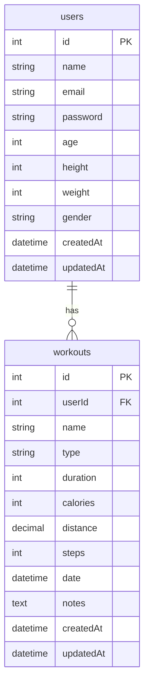

# 数据库设计

本文档详细说明了Fitness Tracker应用的数据库设计。

## 数据库选型

Fitness Tracker使用MySQL 8.0作为数据库管理系统，通过Sequelize ORM进行数据库操作。

## 数据库表结构

### 用户表 (users)

存储用户的基本信息和认证信息。

```sql
CREATE TABLE users (
  id INT UNSIGNED AUTO_INCREMENT PRIMARY KEY,
  name VARCHAR(100) NOT NULL,
  email VARCHAR(100) NOT NULL UNIQUE,
  password VARCHAR(255) NOT NULL,
  age TINYINT UNSIGNED,
  height SMALLINT UNSIGNED,
  weight SMALLINT UNSIGNED,
  gender ENUM('male', 'female', 'other'),
  createdAt DATETIME DEFAULT CURRENT_TIMESTAMP,
  updatedAt DATETIME DEFAULT CURRENT_TIMESTAMP ON UPDATE CURRENT_TIMESTAMP
);
```

**字段说明**:
- `id`: 用户唯一标识符，自增主键
- `name`: 用户姓名，最大100字符
- `email`: 用户邮箱，最大100字符，唯一且不能为空
- `password`: 用户密码，经过bcrypt加密存储，最大255字符
- `age`: 用户年龄，无符号tinyint
- `height`: 用户身高(cm)，无符号smallint
- `weight`: 用户体重(kg)，无符号smallint
- `gender`: 用户性别，枚举类型('male', 'female', 'other')
- `createdAt`: 记录创建时间，默认当前时间戳
- `updatedAt`: 记录更新时间，默认当前时间戳，更新时自动刷新

### 运动记录表 (workouts)

存储用户的运动记录信息。

```sql
CREATE TABLE workouts (
  id INT UNSIGNED AUTO_INCREMENT PRIMARY KEY,
  userId INT UNSIGNED NOT NULL,
  name VARCHAR(100) NOT NULL,
  type ENUM('running', 'cycling', 'swimming', 'walking', 'strength', 'yoga', 'other') NOT NULL,
  duration SMALLINT UNSIGNED NOT NULL,
  calories SMALLINT UNSIGNED NOT NULL,
  distance DECIMAL(5,2),
  steps MEDIUMINT UNSIGNED,
  date DATETIME NOT NULL,
  notes TEXT,
  createdAt DATETIME DEFAULT CURRENT_TIMESTAMP,
  updatedAt DATETIME DEFAULT CURRENT_TIMESTAMP ON UPDATE CURRENT_TIMESTAMP,
  FOREIGN KEY (userId) REFERENCES users(id) ON DELETE CASCADE ON UPDATE CASCADE
);
```

**字段说明**:
- `id`: 运动记录唯一标识符，自增主键
- `userId`: 关联用户ID，外键关联users表的id字段
- `name`: 运动名称，最大100字符
- `type`: 运动类型，枚举类型('running', 'cycling', 'swimming', 'walking', 'strength', 'yoga', 'other')
- `duration`: 运动时长(分钟)，无符号smallint
- `calories`: 消耗卡路里，无符号smallint
- `distance`: 运动距离(公里)，decimal类型(5,2)
- `steps`: 步数，无符号mediumint
- `date`: 运动日期时间
- `notes`: 备注信息，text类型
- `createdAt`: 记录创建时间，默认当前时间戳
- `updatedAt`: 记录更新时间，默认当前时间戳，更新时自动刷新
- 外键约束：userId字段引用users表的id字段，级联删除和更新

## 索引设计

为了提高查询性能，我们在以下字段上创建了索引：

### 用户表索引
- `email`: 唯一索引，用于快速查找用户和确保邮箱唯一性

### 运动记录表索引
- `userId`: 普通索引，用于快速查找特定用户的所有运动记录
- `date`: 普通索引，用于按日期范围查询运动记录
- `type`: 普通索引，用于按运动类型统计查询

## 数据库关系图



## 数据初始化

在项目根目录的`mysql/init.sql`文件中包含了数据库初始化脚本，用于创建数据库表结构。

```sql
-- 创建数据库
CREATE DATABASE IF NOT EXISTS fitnessTracker;

-- 使用数据库
USE fitnessTracker;

-- 创建用户表
CREATE TABLE IF NOT EXISTS users (
  id INT UNSIGNED AUTO_INCREMENT PRIMARY KEY,
  name VARCHAR(100) NOT NULL,
  email VARCHAR(100) NOT NULL UNIQUE,
  password VARCHAR(255) NOT NULL,
  age TINYINT UNSIGNED,
  height SMALLINT UNSIGNED,
  weight SMALLINT UNSIGNED,
  gender ENUM('male', 'female', 'other'),
  createdAt DATETIME DEFAULT CURRENT_TIMESTAMP,
  updatedAt DATETIME DEFAULT CURRENT_TIMESTAMP ON UPDATE CURRENT_TIMESTAMP
);

-- 创建运动记录表
CREATE TABLE IF NOT EXISTS workouts (
  id INT UNSIGNED AUTO_INCREMENT PRIMARY KEY,
  userId INT UNSIGNED NOT NULL,
  name VARCHAR(100) NOT NULL,
  type ENUM('running', 'cycling', 'swimming', 'walking', 'strength', 'yoga', 'other') NOT NULL,
  duration SMALLINT UNSIGNED NOT NULL,
  calories SMALLINT UNSIGNED NOT NULL,
  distance DECIMAL(5,2),
  steps MEDIUMINT UNSIGNED,
  date DATETIME NOT NULL,
  notes TEXT,
  createdAt DATETIME DEFAULT CURRENT_TIMESTAMP,
  updatedAt DATETIME DEFAULT CURRENT_TIMESTAMP ON UPDATE CURRENT_TIMESTAMP,
  FOREIGN KEY (userId) REFERENCES users(id) ON DELETE CASCADE ON UPDATE CASCADE
);
```

## 数据备份与恢复

### 备份数据库
```bash
mysqldump -u username -p fitnessTracker > fitnessTracker_backup.sql
```

### 恢复数据库
```bash
mysql -u username -p fitnessTracker < fitnessTracker_backup.sql
```

## 数据库安全

1. **密码加密**: 用户密码使用bcrypt进行加密存储
2. **SQL注入防护**: 使用Sequelize ORM避免直接拼接SQL语句
3. **访问控制**: 通过JWT Token验证用户身份，确保只能访问自己的数据
4. **数据验证**: 在应用层面对所有输入数据进行验证