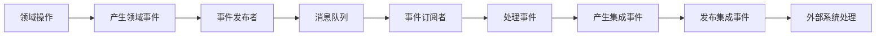

# 事件规范 (Event Specification)

## 1. 领域事件

### 1.1 UserCreatedEvent

当用户成功创建时触发此事件。

**事件属性：**
- eventId: String (事件唯一标识)
- userId: Long (用户ID)
- username: String (用户名)
- email: String (邮箱)
- timestamp: DateTime (事件发生时间)

**事件内容示例：**
```json
{
  "eventId": "evt_1234567890",
  "userId": 1,
  "username": "john_doe",
  "email": "john@example.com",
  "timestamp": "2023-01-01T00:00:00Z"
}
```

### 1.2 UserUpdatedEvent

当用户信息被更新时触发此事件。

**事件属性：**
- eventId: String (事件唯一标识)
- userId: Long (用户ID)
- oldValues: Map<String, Object> (更新前的值)
- newValues: Map<String, Object> (更新后的值)
- timestamp: DateTime (事件发生时间)

**事件内容示例：**
```json
{
  "eventId": "evt_0987654321",
  "userId": 1,
  "oldValues": {
    "email": "john@example.com"
  },
  "newValues": {
    "email": "john.doe@example.com"
  },
  "timestamp": "2023-01-02T00:00:00Z"
}
```

### 1.3 UserDeletedEvent

当用户被删除时触发此事件。

**事件属性：**
- eventId: String (事件唯一标识)
- userId: Long (用户ID)
- username: String (用户名)
- timestamp: DateTime (事件发生时间)

**事件内容示例：**
```json
{
  "eventId": "evt_1357924680",
  "userId": 1,
  "username": "john_doe",
  "timestamp": "2023-01-03T00:00:00Z"
}
```

## 2. 集成事件

### 2.1 SendWelcomeEmailEvent

当用户创建成功后，发送欢迎邮件的集成事件。

**事件属性：**
- eventId: String (事件唯一标识)
- userId: Long (用户ID)
- email: String (邮箱地址)
- template: String (邮件模板)
- timestamp: DateTime (事件发生时间)

### 2.2 SyncUserToSearchEngineEvent

当用户信息变更后，同步到搜索引擎的集成事件。

**事件属性：**
- eventId: String (事件唯一标识)
- userId: Long (用户ID)
- userData: Map<String, Object> (用户数据)
- operation: String (操作类型: CREATE, UPDATE, DELETE)
- timestamp: DateTime (事件发生时间)

## 3. 事件发布/订阅机制

### 3.1 事件发布者

```java
public interface EventPublisher {
    void publish(DomainEvent event);
}
```

### 3.2 事件订阅者

```java
public interface EventSubscriber {
    void handle(DomainEvent event);
}
```

### 3.3 事件总线

```java
public interface EventBus {
    void register(String eventType, EventSubscriber subscriber);
    void unregister(String eventType, EventSubscriber subscriber);
    void publish(DomainEvent event);
}
```

## 4. 消息队列配置

### 4.1 Topic 定义

- user-events: 用户相关领域事件
- integration-events: 集成事件

### 4.2 消息格式

所有事件消息遵循以下格式：

```json
{
  "eventId": "string",
  "eventType": "string",
  "timestamp": "ISO8601 datetime",
  "payload": "object",
  "metadata": {
    "source": "string",
    "version": "string"
  }
}
```

## 5. 事件处理流程

