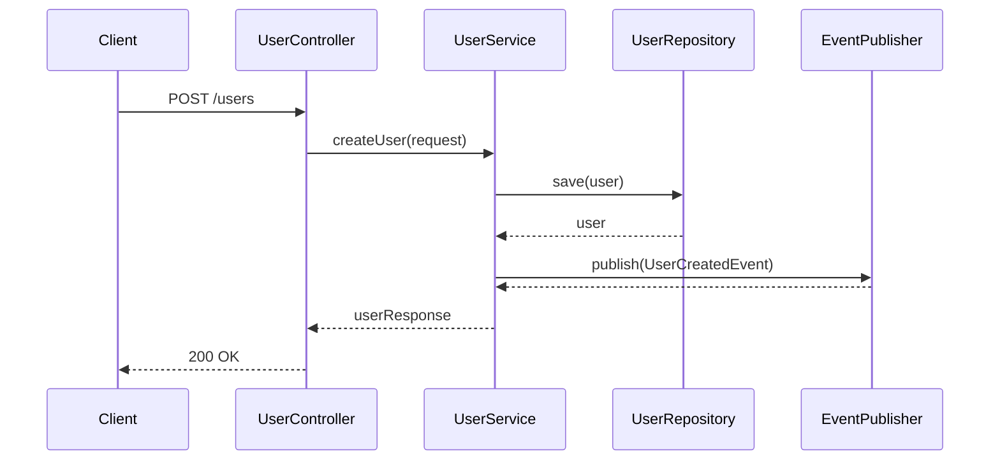
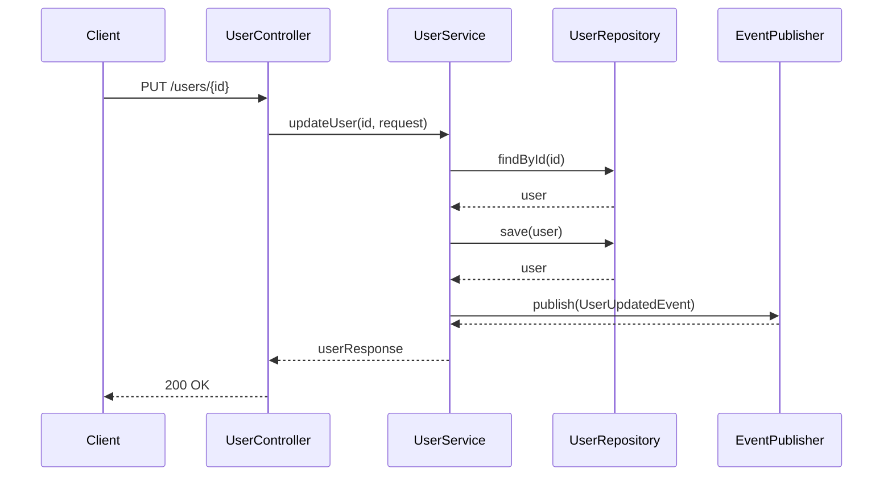
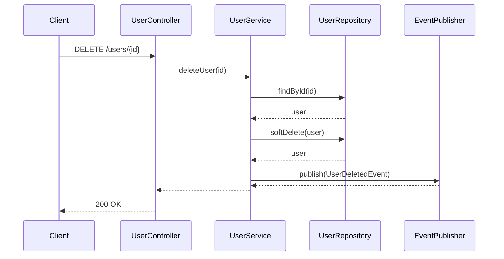
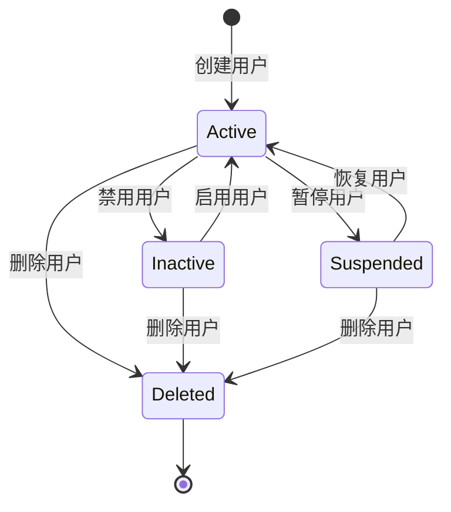
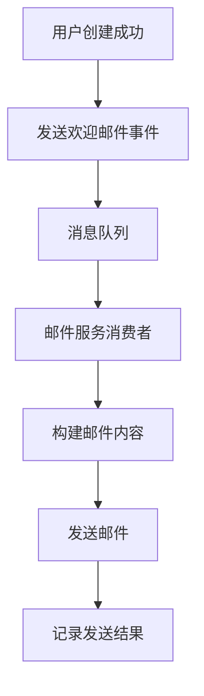
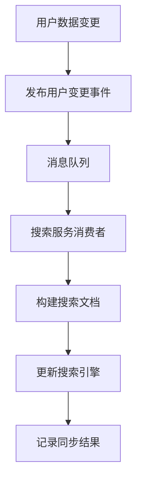

# 流程规范 (Workflow Specification)

## 1. 用户管理流程

### 1.1 创建用户流程

### 1.2 更新用户流程

### 1.3 删除用户流程

## 2. 状态机

### 2.1 用户状态转换

## 3. 生命周期管理

### 3.1 用户生命周期

1. **创建阶段**
   - 用户注册或由管理员创建
   - 验证必要字段（用户名、邮箱）
   - 发送欢迎邮件（异步）

2. **活跃阶段**
   - 用户正常使用系统功能
   - 定期更新用户信息
   - 登录行为记录

3. **暂停阶段**
   - 用户违反规定被暂时冻结
   - 保留所有数据但限制访问

4. **删除阶段**
   - 软删除用户（保留30天）
   - 清除敏感数据
   - 物理删除（30天后）

## 4. 异步任务流程

### 4.1 发送欢迎邮件

### 4.2 数据同步到搜索引擎

